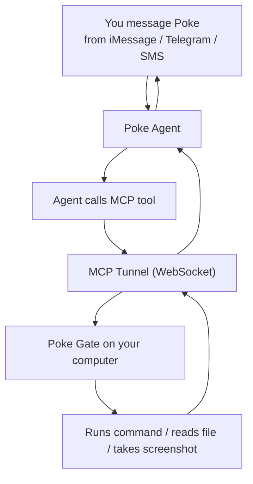

<p align="center">
  
</p>

<h1 align="center">Poke Gate</h1>

<p align="center">
  Let your <a href="https://poke.com">Poke</a> AI assistant access your machine.<br>
  <sub>Windows-first fork maintained by <a href="https://github.com/alextyhwang">Alex Wang</a> — not affiliated with Poke or The Interaction Company.</sub>
</p>

<p align="center">
  <a href="https://github.com/alextyhwang/poke-gate/releases/latest"></a>
  <a href="https://www.npmjs.com/package/poke-gate"></a>
  <a href="https://github.com/alextyhwang/poke-gate/blob/main/LICENSE"></a>
  
</p>

---

Run Poke Gate on your computer, then message Poke from iMessage, Telegram, or SMS to run commands, read files, take screenshots, and start Codex tasks — all on your machine.

## Install

**Windows 10/11**

From Windows PowerShell in a checkout with `npm ci` completed:

```powershell
powershell.exe -NoProfile -ExecutionPolicy Bypass -File .\scripts\install-windows.ps1
```

This installs a private runtime and native security host under `%LOCALAPPDATA%\Poke Gate`, then registers a per-user background task at sign-in. Add `-StartNow` to start it immediately or `-InstallTray $true` for the optional notification-area controller. See [Windows deployment](docs/windows.md) for security and measured resource use.

### Connect or reconnect on Windows

The installer registers a per-user task that reconnects automatically whenever you sign in. To start it manually:

```powershell
Start-ScheduledTask -TaskName "Poke Gate"
```

If Poke's normal sign-in is unavailable, create a Poke account key at [poke.com/kitchen/api-keys](https://poke.com/kitchen/api-keys). Do not create a new MCP integration. Then run the local setup prompt so the key is saved directly on the computer and never sent through chat:

```powershell
powershell.exe -NoProfile -ExecutionPolicy Bypass -File "$env:LOCALAPPDATA\Poke Gate\app\scripts\configure-poke-api-key.ps1"
```

The setup prompt restricts the credential file to the current Windows account and restarts the gateway. Check status and recent logs with:

```powershell
Get-ScheduledTask -TaskName "Poke Gate"
Get-Content "$env:LOCALAPPDATA\Poke Gate\logs\poke-gate.log" -Tail 20
```

To stop it for the current session:

```powershell
Stop-ScheduledTask -TaskName "Poke Gate"
```

**macOS**

**Homebrew** (recommended)

```bash
brew install f/tap/poke-gate
```

**Install via npx**

If you have Node.js installed, you can download and install the macOS app with a single command:

```bash
npx poke-gate download-macos
```

This downloads the latest DMG from GitHub Releases, installs the app to `/Applications`, and clears the quarantine flag automatically.

**Don't have Node.js?** Install it first:

```bash
# Option 1: Homebrew
brew install node

# Option 2: Download from https://nodejs.org
```

**Manual download**

Download the latest **Poke.macOS.Gate.dmg** from [Releases](https://github.com/alextyhwang/poke-gate/releases), open it, and drag to Applications. Since the app is not notarized, you may need to run:

```bash
xattr -cr /Applications/Poke\ macOS\ Gate.app
```

**CLI only** (no macOS app needed)

If you just want to run poke-gate from the terminal without the menu bar app:

```bash
npx poke-gate
```

## Setup on macOS

1. Open Poke Gate from your menu bar
2. The **Setup View** guides you through choosing an access mode and granting Accessibility permission
3. Sign in with Poke OAuth when prompted — a browser window opens automatically

The app connects automatically and shows a green dot when ready.

## How it works



Poke Gate runs a local MCP server and tunnels it to Poke's cloud. When you ask Poke something that needs your machine, the agent calls the tools, Poke Gate executes them locally, and the result flows back to your chat.

## Tools

| Tool | What it does |
|------|-------------|
| `run_command` | Execute any shell command (ls, git, brew, python, curl…) |
| `read_file` | Read a text file |
| `read_image` | Read an image file and return it as base64 |
| `write_file` | Write content to a file |
| `list_directory` | List files and directories |
| `system_info` | OS, hostname, architecture, uptime, memory |
| `take_screenshot` | Capture the screen (requires Screen Recording permission) |
| `run_agent` | Start an asynchronous Codex run (defaults to Documents) |
| `get_agent_run` | Check a Codex run's status and output |
| `cancel_agent_run` | Terminate a Codex run's process tree |

## Examples

From iMessage or Telegram, ask Poke:

- "What's running on port 3000?"
- "Show me the last 5 git commits in my project"
- "How much disk space do I have left?"
- "Read my ~/.zshrc and suggest improvements"
- "Take a screenshot of my screen"
- "Create a file called notes.txt on my Desktop"

## macOS App

The native SwiftUI menu bar app manages everything:

- **First-run setup** — guided onboarding to choose an access mode and grant Accessibility permission
- **Status** — green dot when connected, yellow when connecting, red on error
- **Personalized** — shows "Connected to your Poke, name"
- **Access mode** — switch between Full, Limited, and Sandbox from Settings or the popover
- **Accessibility-first** — prompts for Accessibility permission (needed for automation) with live status updates
- **Auto-start** — connects on launch if signed in via OAuth
- **Auto-restart** — reconnects automatically if the connection drops
- **Logs** — view real-time tool calls with sandbox status
- **About** — version pulled dynamically from the app bundle

The app runs in the menu bar only (no Dock icon). Quit is the only way to stop it.

### Building from source

Requires macOS 15+ and Xcode 26+.

```bash
git clone https://github.com/alextyhwang/poke-gate.git
cd poke-gate/clients/Poke\ macOS\ Gate
open Poke\ macOS\ Gate.xcodeproj
```

Hit **Run** in Xcode, or build from the command line:

```bash
./build.sh
```

## CLI usage

The CLI requires [Node.js](https://nodejs.org) 18 or later. If you don't have it, install via `brew install node` or download from [nodejs.org](https://nodejs.org).

Start the gate:

```bash
npx poke-gate
```

On first run, Poke OAuth opens in your browser. Add `--verbose` to see tool calls in real time:

```bash
npx poke-gate --verbose
```

Set the access mode with `--mode`:

```bash
npx poke-gate --mode limited
npx poke-gate --mode sandbox
```

Install or update the macOS app:

```bash
npx poke-gate download-macos
```

Disconnect old Poke Gate MCP connections:

```bash
npx poke-gate disconnect-all
```

This opens a temporary Chrome/Chromium browser login window, then deletes only MCP connections named `poke-gate`.

Config is stored at `~/.config/poke-gate/config.json`.

## Agents

<p align="center">
  
</p>

Agents are scheduled scripts that run automatically in the background. They live in `~/.config/poke-gate/agents/` and follow a simple naming convention:

```
<name>.<interval>.js
```

| File | Runs |
|------|------|
| `beeper.1h.js` | Every hour |
| `backup.2h.js` | Every 2 hours |
| `health.10m.js` | Every 10 minutes |
| `cleanup.30m.js` | Every 30 minutes |

Intervals: `Nm` (minutes) or `Nh` (hours). Minimum is 10 minutes.

### Install an agent

Download a community agent from the repository:

```bash
npx poke-gate agent get beeper
```

This downloads `beeper.1h.js` and `.env.beeper` to `~/.config/poke-gate/agents/`. Edit the env file with your credentials and test it:

```bash
nano ~/.config/poke-gate/agents/.env.beeper
npx poke-gate run-agent beeper
```

### Per-agent env files

Each agent can have a `.env.<name>` file for secrets:

```
~/.config/poke-gate/agents/.env.beeper
```

```env
BEEPER_TOKEN=your_token_here
```

Variables are injected into the agent process automatically.

### Agent frontmatter

Each agent file starts with a JSDoc-style frontmatter block:

```javascript
/**
 * @agent beeper
 * @name Beeper Message Digest
 * @description Fetches messages from the last hour and sends a summary to Poke.
 * @interval 1h
 * @env BEEPER_TOKEN - Beeper Desktop local API token
 * @author alextyhwang
 */
```

### Creating your own agent

An agent is just a JS file that runs with Node.js. It has access to:

- `process.env` — variables from `.env.<name>`
- `poke` package — `import { Poke, getToken } from "poke"`
- Any npm package installed globally or via npx

```javascript
/**
 * @agent my-agent
 * @name My Custom Agent
 * @description Does something useful every 30 minutes.
 * @interval 30m
 */

import { Poke, getToken } from "poke";

const poke = new Poke({ apiKey: getToken() });
await poke.sendMessage("Hello from my agent!");
```

Save as `~/.config/poke-gate/agents/my-agent.30m.js` and it runs automatically when poke-gate is connected.

Agents start running when poke-gate connects and run once immediately on startup.

## Access modes

Poke Gate supports three access modes that control what your agent can do:

| Mode | Description |
|------|-------------|
| **Full** (default) | All tools available with no approval required. The agent can run commands, write files, and take screenshots directly. |
| **Limited** | Read-only tools plus a curated set of safe commands (`ls`, `cat`, `grep`, `curl`, etc.). `write_file` and `take_screenshot` are disabled. |
| **Sandbox** | Broader command support under an OS sandbox. Windows uses a restricted Low-integrity token and Job Object; macOS uses `sandbox-exec`. |

Set the mode via CLI flag, environment variable, or the macOS app Settings:

```bash
npx poke-gate --mode sandbox
# or
POKE_GATE_PERMISSION_MODE=limited npx poke-gate
```

## Security

**In full mode, Poke Gate grants full shell access to your Poke agent.** This means:

- Any command can be run with your user's permissions
- Files can be read and written anywhere your user has access
- Risky tools require approval in chat before execution
- Only your Poke agent (authenticated via Poke OAuth) can reach the tunnel

Only run Poke Gate on machines and networks you trust. Use `limited` or `sandbox` mode if you want tighter restrictions.

## Credits

- [Poke](https://poke.com) by [The Interaction Company of California](https://interaction.co)
- [Poke SDK](https://www.npmjs.com/package/poke)

## License

MIT
